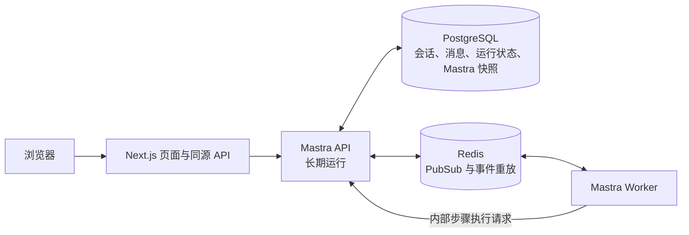

以“每条消息启动一个可查询的后台运行”为核心改造。目标是：在对话 A 发送任务后，切到对话 B、关闭浏览器，甚至重启 Next.js，A 的任务仍由 Mastra 服务继续执行；回来时依据 `runId` 恢复进度和结果。

以下按“Next.js + 独立 Mastra API / Worker + 已有 PostgreSQL / Redis”设计。当前项目无需先更换聊天界面。

## 1. 目标架构



进程职责要明确：

| 组件 | 职责 |
| --- | --- |
| Next.js | 展示聊天、校验用户、转发创建任务及查询请求；不执行 Agent |
| Mastra API | 启动 Evented Agent、提供状态和订阅接口、恢复运行 |
| Worker | 消费编排事件及明确配置为后台执行的工具任务 |
| PostgreSQL | 保存长期可信状态，包括 `runId`、消息、工作流快照 |
| Redis | 跨进程传递事件，缓存近期流事件供断线重放 |

这里有个重要边界：Mastra 的独立编排 Worker 在拆分部署时，会通过内部 HTTP 请求让 Mastra API 执行步骤。因此 LLM 和部分工具调用仍可能占用 **Mastra API** 进程，但不会占用 **Next.js 的聊天请求**。[Mastra Workers 文档](https://mastra.ai/docs/deployment/workers)

## 2. 改造聊天任务的生命周期

目前 [聊天路由](/Users/keen/Downloads/mastra-ai-sdk-streaming-chat/src/app/api/chat/route.ts:9) 直接调用 `handleChatStream()` 并等待响应流。改成下面的协议：

```text
POST /api/threads/:threadId/runs
  请求：{ text, clientRequestId }
  响应：202 { runId, status: "queued" }

GET /api/threads/:threadId
  响应：标题、历史消息、当前 runId 和状态

GET /api/runs/:runId
  响应：running / waiting_approval / succeeded / failed / cancelled

GET /api/runs/:runId/events?after=<seq>
  响应：后续文本、工具、子 Agent、工作流等事件

POST /api/runs/:runId/cancel
  显式取消；切换对话不调用它
```

发送时由服务端生成 `runId`，先保存用户消息和 `queued` 记录，然后启动 Evented Agent，马上返回 `202`。浏览器随后订阅事件；订阅断开只影响展示，不取消运行。Mastra 的 `createEventedAgent()` 正是用于启动后不等待整个工作流完成的模式。[Durable Agents 文档](https://mastra.ai/docs/harness/durable-agents)

同一对话先限制为一次只运行一个任务；不同对话可并行。`clientRequestId` 加唯一约束，防止用户重试或网络重发时重复执行。

## 3. Agent 和 Mastra 配置

把 [chat-agent.ts](/Users/keen/Downloads/mastra-ai-sdk-streaming-chat/src/mastra/agents/chat-agent.ts:21) 中现有 `Agent` 配置保留为基础 Agent，再用 `createEventedAgent({ agent })` 包装。注册到 [Mastra 实例](/Users/keen/Downloads/mastra-ai-sdk-streaming-chat/src/mastra/index.ts:26) 的应是包装后的 Agent。

Mastra 实例需要配置四类能力：

- `storage`：改为共享 PostgreSQL。
- `pubsub`：`RedisStreamsPubSub`，供 API 与 Worker 通信。
- `cache`：`RedisServerCache`，供 `observe(runId)` 补发断线期间的流事件。
- `recovery: { durableAgents: 'auto' }`：Mastra 服务重启后恢复遗留的运行。

`pubsub` 和 `cache` 虽然都可以使用 Redis，但用途不同；只配置 Redis Streams，不能保证完整重放聊天流。官方文档说明了缓存、`observe()` 和恢复机制。[Durable Agents 文档](https://mastra.ai/docs/harness/durable-agents)

现阶段 Mastra API 先保持**单实例**。官方文档指出，多实例同时开启自动恢复时可能争抢同一运行；将来扩容需要自行选主，或采用 Inngest 等执行后端。[恢复限制](https://mastra.ai/docs/harness/durable-agents)

## 4. 服务端数据模型

Mastra 自己的 Memory 继续保存 Agent 对话上下文。应用另外保存页面所需的数据，避免把 `localStorage` 当作任务状态来源：

```text
chat_threads
  id, owner_id, title, created_at, updated_at, deleted_at

chat_runs
  id, thread_id, client_request_id, status,
  last_event_seq, started_at, finished_at, error

chat_messages
  id, thread_id, run_id, role, parts_json, created_at

chat_run_events
  run_id, seq, type, payload_json, created_at
  UNIQUE(run_id, seq)
```

`chat_run_events` 保存可展示、已过滤敏感内容的事件；PostgreSQL 是长期历史，Redis 是近期实时传递。恢复页面时先读取数据库快照，再从 `last_event_seq` 接续订阅，按 `(runId, seq)` 去重。这样即使 Redis 的缓存已经清理，最终回答仍可从数据库取回。

状态转换建议固定为：

```text
queued → running → succeeded
                 → failed
                 → waiting_approval → running
                 → cancelled
```

侧栏“执行中”读取 `chat_runs.status`，不再依据 `useChat.status` 或某个未完成的工具片段猜测。[AppShell.tsx](/Users/keen/Downloads/mastra-ai-sdk-streaming-chat/src/components/AppShell.tsx:35) 目前主要从浏览器 `localStorage` 恢复会话，这是造成切换后状态不可靠的关键原因。

## 5. 前端恢复流程

[ChatPanel.tsx](/Users/keen/Downloads/mastra-ai-sdk-streaming-chat/src/components/ChatPanel.tsx:53) 需要把“发送消息”和“观察任务”分开：

1. 进入对话：获取服务端消息与最新 `runId`。
2. 若任务正在执行：用 `runId` 和最后事件序号订阅。
3. 切走：关闭当前页面订阅，保留后台运行。
4. 切回：重新获取状态及遗漏事件。
5. 收到 `succeeded / failed / cancelled`：更新消息与侧栏状态。

现有 `MessagePart`、`AssistantMessage`、`ExecutionTrace` 可以继续负责显示；要替换的是它们上游的状态来源。单独设置 `useChat({ resume: true })` 不够，因为默认的聊天流接口目前没有对应的运行记录和恢复协议。

## 6. 部署与运行

本机运行 `next`、`mastra-api`、`mastra-worker`，共用外部项目现有的 PostgreSQL 和 Redis。Mastra API 和 Worker 使用同一套构建代码、数据库、Redis 地址及模型密钥。

关键环境配置：

```text
Mastra API:     MASTRA_WORKERS=false
Mastra Worker:  MASTRA_WORKERS=orchestration,backgroundTasks
Worker:         MASTRA_STEP_EXECUTION_URL=http://127.0.0.1:4111/api
双方:           DATABASE_URL、REDIS_URL、AI_API_KEY
```

当前 [storage.ts](/Users/keen/Downloads/mastra-ai-sdk-streaming-chat/src/mastra/storage.ts:11) 在配置 `DATABASE_URL` 后使用 PostgreSQL。API 和 Worker 共用 `mastra_streaming_chat` 数据库及 Redis DB 15；详细本地启动命令见 [background-runtime.md](background-runtime.md)。

Next.js 到 Mastra API 走内部地址。实时事件可由反向代理转给 Mastra API；如果部署平台限制长连接，则使用短时 SSE 自动重连，或者先以每 1–2 秒查询状态实现稳定版本。

## 7. 当前项目的额外迁移点

- 现有 `localStorage` 会话：首次访问时做一次导入，再由服务端接管；不要直接清空用户历史。
- 现有审批工作流：保存其 `workflowRunId` 与聊天 `runId` 的关联，等待审批应显示 `waiting_approval`，不能显示为无限“执行中”。
- `listFiles/writeFile/runCommand` 使用本地 `workspace`；拆进程后要确定统一挂载位置。当前 [MCP 客户端](/Users/keen/Downloads/mastra-ai-sdk-streaming-chat/src/mastra/mcp/client.ts:12) 还依赖项目内的 `mcp/local-server.mjs`，Mastra API 构建产物需要包含或能访问它。
- `runCommand` 有真实命令副作用。故障恢复可能重放工具步骤；生产环境应给文件写入和外部操作加幂等键，并把命令执行放进隔离容器。官方也明确提醒恢复可能再次执行工具调用。[恢复与重放说明](https://mastra.ai/docs/harness/durable-agents)
- 现在客户端固定发送 `resource: 'browser-demo-user'`。上线时必须从服务端登录态生成用户标识，并校验 `threadId/runId` 所属用户。

## 8. 实施顺序与验收

建议分三批，每批都能独立验证：

1. **任务化聊天**：独立 Mastra API、Evented Agent、`runId`、服务端会话及重新订阅。先验证切换对话、刷新页面、关闭再打开浏览器。
2. **共享基础设施**：PostgreSQL、Redis PubSub 与缓存、运行状态持久化。验证重启 Next.js 后任务不中断。
3. **独立 Worker 与恢复**：拆分 Worker、启用自动恢复和幂等处理。验证重启 Worker、重启 Mastra API、审批挂起与恢复、重复发送请求。

最终验收标准很具体：在对话 A 启动一个超过两分钟的任务，立即切到 B 发消息；A 和 B 都能各自执行。关闭浏览器后再回来，A 能展示遗漏进度或最终结果；任何失败都显示明确失败状态，不再永久停在“执行中”。
